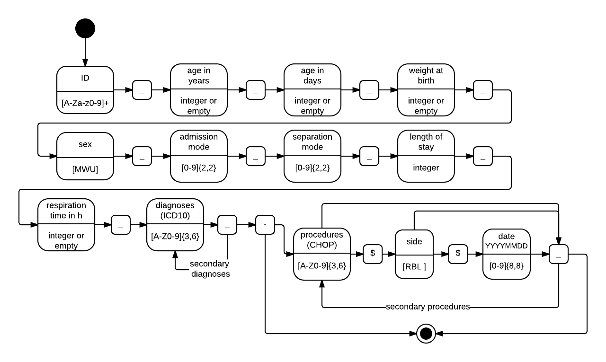

# grouperserve
Microservice / WebAPI for the SwissDRG grouper. Provided as a REST JSON API over HTTP/HTTPS using the Java framework Spark.

## Getting started

Build jar:
`gradle build`

Run grouper server:
`java -cp build/libs/grouperserve-0.1.1.jar ch.eonum.grouperserve.GrouperServe`

Test this URL in your browser:
`http://localhost:4567/systems`
You should obtain a list of all provided SwissDRG systems in a JSON array.

## The patient case URL format

## API calls

If you test the API in your shell e.g. using curl:
`export ROOT_URL=http://localhost:4567`

### systems
Obtain a list of available SwissDRG systems.

URL:
`GET /systems`
sample call using curl:

``curl "$ROOT_URL/systems"``

### group
Group a patient case and obtain a grouper result and an effective cost weight.

URL:
`POST /group`

Parameters:
* pc: patient case in the URL patient case format
* version: version identifier as provided by /systems
* pp: pretty print (default is false)
	

sample call using curl: 

``curl --header "Accept: application/json" --data "version=V5_A&pc=AI34221_65_0_0_M_01_00_1_0_I481_Z921_F051_-_8954_pp=true" "$ROOT_URL/group"``

